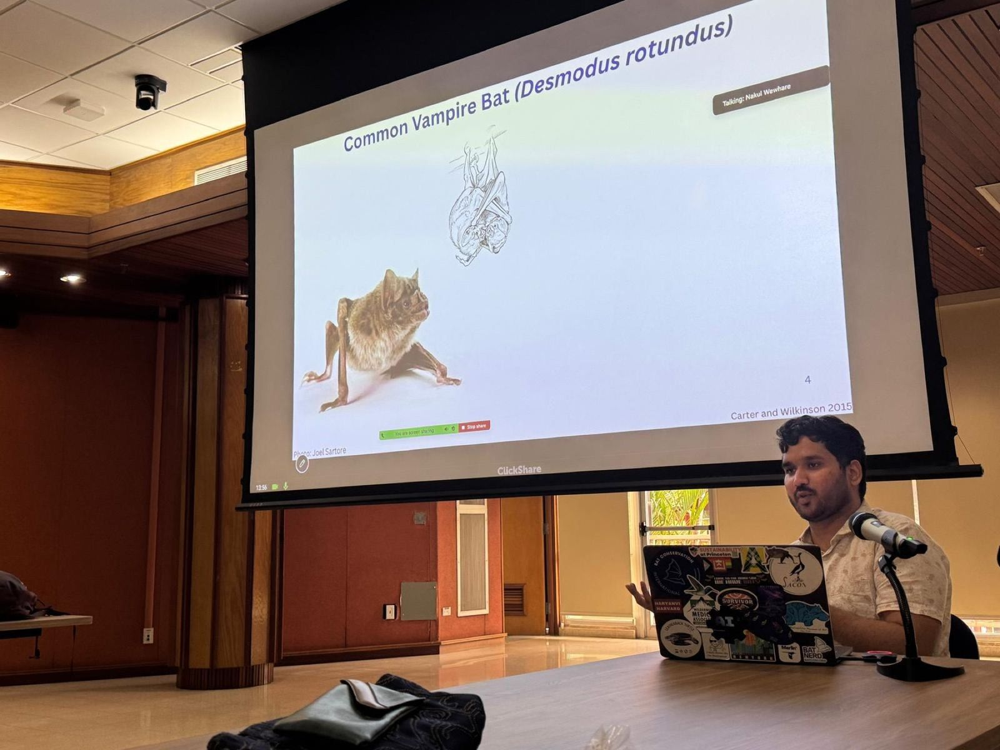
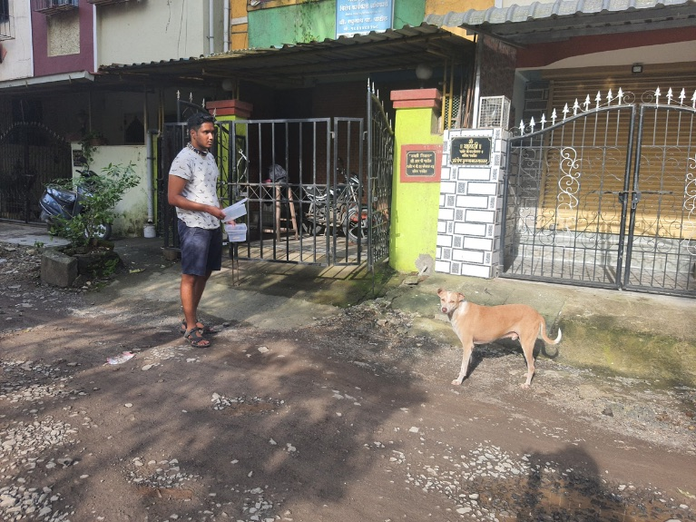
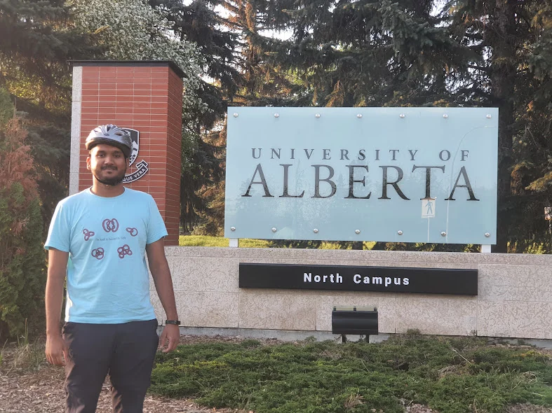
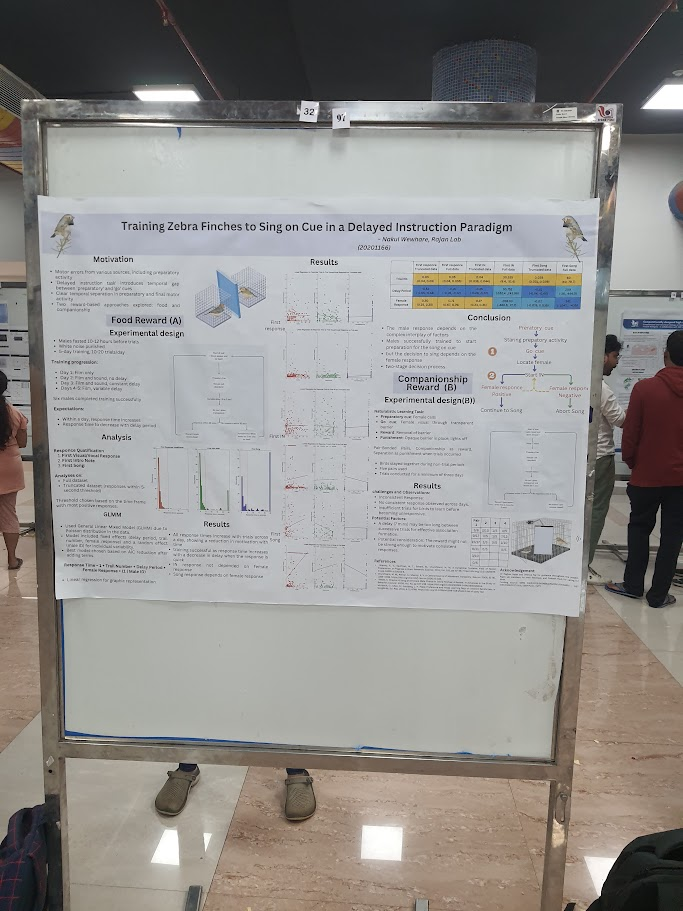

::: {.visual-hero .visual-hero--compact}
::: {.visual-hero__content}
::: {.visual-hero__kicker}
About Nakul
:::

# Why I study how animals “talk” to each other

The simplest description of my scientific interest is that I want to understand how animals “talk” to each other: what they communicate, how a signal is directed to a particular partner, what changes when calls are combined, and how individuals learn the vocal patterns of a pair or group.

I use *talk* as a broad, informal term rather than a claim that animal communication is equivalent to human language. A longer-term hope is that an experimentally grounded account of another species' communication system could support a limited form of interspecies communication. Current research remains far from a genuine conversation, but several component questions are increasingly tractable: who produced a signal, who responded, which features vary with social context, and whether manipulating those features changes receiver responses.

::: {.cta-row}
[Download my CV](../cv/Nakul_Wewhare_CV.pdf){.btn .btn-primary}
[Research programme](../research/){.btn .btn-outline-primary}
:::
:::

::: {.visual-hero__media}
```{=html}

```
:::

::: {.visual-hero__credit}
Speaking about vampire-bat research at a behaviour-group seminar in the Smithsonian Tropical Research Institute's Tupper building, Panama.
:::
:::

## Research questions

Animal communication is structured across several levels: calls occur within sequences, responses depend on particular partners, and vocal behaviour can change through social learning. My work therefore addresses both **the information represented in vocal interactions** and **the validity of the methods used to infer that information**.

::: {.feature-grid}
::: {.feature-card}
### Interactional and sequence structure

How are vocal exchanges initiated and maintained? Does acoustic matching predict directed responses? How do order, repetition, and timing alter the information available to a receiver?
:::

::: {.feature-card}
### Social learning and group conventions

Do partners or groups converge in call structure or sequence organization? How do affiliation, dominance, audience, and social-network position affect vocal learning?
:::

::: {.feature-card}
### Individual identity: signal or cue

Which acoustic correlates of caller identity arise incidentally from anatomy, and which are learned or maintained because receivers use them as identity signals?
:::
:::

## Why bats

Bats are a strong comparative system because both perception and vocal production are highly specialized for acoustic behaviour, while their social communication remains less well characterized than echolocation. Common vampire bats are particularly useful because their cooperative behaviour, reciprocity, kinship, and long-term social relationships provide an unusually detailed behavioural framework for interpreting vocal interactions.

My doctoral research investigates vocal matching near the onset of calling bouts, non-random call combinations, population and group variation, and the potential social learning of sequence conventions. These are active analyses and experiments; proposed functions are presented as hypotheses and are separated from descriptive or correlational evidence.

## Previous work

::: {.previous-work-intro}
```{=html}

```

::: {.previous-work-intro__copy}
Before moving to vampire bats, I worked across field behaviour, automated experiments, computer vision, bioacoustics, and social-network analysis. Each project sharpened a different part of the same broad question: how animals use information and how social experience shapes behaviour.
:::
:::

::: {.previous-work-grid}
::: {.previous-work-card}
```{=html}

```

::: {.previous-work-card__body}
[Field experiments · Mumbai]{.previous-work-card__label}

### Sensory decisions in free-ranging dogs

With the Dog Lab at IISER Kolkata, I helped design and run field experiments testing how free-ranging dogs combine visual and olfactory information while scavenging. The resulting preprint has not yet been peer reviewed.

[Project summary](../projects/free-ranging-dog-decision-making.qmd) · [Preprint](https://doi.org/10.48550/arXiv.2512.00058)
:::
:::

::: {.previous-work-card}
```{=html}

```

::: {.previous-work-card__body}
[MITACS Globalink · 2023]{.previous-work-card__label}

### Zebra-finch cognition in Canada

At the University of Alberta's Animal Cognition Research Group, I ran zebra-finch nest-building experiments and developed DeepLabCut and AnimalTA workflows to quantify activity and personality-linked information use.

[Curriculum vitae](../cv/) · [Animal Cognition Research Group](https://sites.psych.ualberta.ca/animal-cognition-ualberta/)
:::
:::

::: {.previous-work-card}
```{=html}

```

::: {.previous-work-card__body}
[Rajan Lab · IISER Pune]{.previous-work-card__label}

### Preparing to sing on cue

I built a microcontroller-based training setup for a delay-instructed zebra-finch singing paradigm and assisted with electrophysiological recordings designed to separate preparation from song production.

[Curriculum vitae](../cv/) · [Rajan Lab](https://raghavrajan.wixsite.com/rajanlab)
:::
:::

::: {.previous-work-card .previous-work-card--text}
::: {.previous-work-card__body}
[Sequence analysis · manuscript in revision]{.previous-work-card__label}

### Sequence convergence in common marmosets

I developed sequence-comparison methods to test how vocal organization changes after pair formation. The public preprint reports audience-dependent convergence in sequence structure, without clear convergence in individual phee-call acoustics.

[Project summary](../projects/marmoset-vocal-convergence.qmd) · [Preprint](https://doi.org/10.64898/2026.03.20.713272)
:::
:::

::: {.previous-work-card .previous-work-card--video}
```{=html}
<video class="previous-work-card__media"
       controls
       playsinline
       preload="metadata"
       poster="../assets/media/budgerigars/budgerigar-courtship-display-poster.jpg"
       aria-label="Two yellow-green budgerigars perch in a recording cage as the male coordinates warble song with repeated head and body movements toward the female.">
  <source src="../assets/media/budgerigars/budgerigar-courtship-display.mp4" type="video/mp4">
  Your browser does not support embedded video.
</video>
```

::: {.previous-work-card__body}
[Peer-reviewed study · 2024]{.previous-work-card__label}

### Song and movement in budgerigar courtship

The clip shows a male directing warble song and repeated head and body movements toward a female. I analysed synchronized vocal and movement sequences from 100 courtship bouts; the study identified both broadly shared and individual-specific note–movement associations.

[Project summary](../projects/budgerigar-multimodal-courtship.qmd) · [Paper](https://doi.org/10.1242/bio.060497)
:::
:::

::: {.previous-work-card .previous-work-card--video}
```{=html}
<video class="previous-work-card__media"
       controls
       playsinline
       preload="metadata"
       poster="../assets/media/budgerigars/budgerigar-colony-social-network-poster.jpg"
       aria-label="A mixed-sex budgerigar colony moves and interacts across perches in a large flight cage.">
  <source src="../assets/media/budgerigars/budgerigar-colony-social-network.mp4" type="video/mp4">
  Your browser does not support embedded video.
</video>
```

::: {.previous-work-card__body}
[BS–MS thesis · 2024–2025]{.previous-work-card__label}

### Social networks and vocal learning

This colony video shows the observation setting used for manual behavioural annotation. For my master's thesis, I constructed interaction and association networks from formally coded behaviour, then tested whether social-network structure predicted longitudinal change in vocal repertoires.

[Project summary](../projects/social-networks-and-vocal-learning.qmd)
:::
:::
:::

## How I think about methods

Every acoustic representation emphasizes some dimensions of signal variation and suppresses others. LFCCs, MFCCs, spectro-temporal measurements, dynamic time warping, and variational autoencoders can therefore produce different similarity structures. I compare representations and validation criteria to determine which biological inferences are robust to these analytical choices.

Separately, I am evaluating whether distributional models adapted from natural-language processing can recover functional relationships among discrete call types from sequence context. Simulation provides a controlled test of representation recovery; empirical validation requires comparison with independently annotated behaviour and receiver responses. This distinction is important: an acoustic space represents similarity in signal structure, whereas a contextual embedding represents similarity in patterns of use.

The [Research](../research/) section links these questions to specific datasets and projects. [Publications](../publications/) lists formal research outputs, and the [Blog](../notes/) contains field reports, analysis updates, methods notes, and literature syntheses.

## Elsewhere

::: {.contact-grid}
::: {.feature-card}
### Curriculum vitae

[View the CV page](../cv/) or [download the PDF](../cv/Nakul_Wewhare_CV.pdf).
:::

::: {.feature-card}
### Google Scholar

[Browse publications and citations](https://scholar.google.com/citations?user=T08iq_UAAAAJ&hl=en).
:::

::: {.feature-card}
### GitHub

[Explore code and repositories](https://github.com/Nakul-wewhare).
:::

::: {.feature-card}
### Carter Lab

[Vampire-bat communication, cooperation, and social cognition](https://socialbat.org/) at Princeton EEB.
:::
:::

::: {.collaboration-cta}
::: {.collaboration-cta__content}
## Something here catch your attention?

Send me a note. I am always happy to talk about animal communication, exchange ideas, help where I can, or hear about a dataset or method you are excited about. The idea can be early and the email can be short.
:::

::: {.collaboration-cta__actions}
[Email me](mailto:nakul@princeton.edu){.btn .btn-primary}
[Visit the blog](../notes/){.btn .btn-outline-primary}
:::
:::

## The institutions that shaped my science

My academic path is an important part of how I see myself as a scientist. I am now a PhD student in Princeton's Department of Ecology & Evolutionary Biology and a member of the Carter Lab. Before Princeton, the BS–MS programme at IISER Pune gave me the freedom to move across biology, mathematics, computation, and animal behaviour; my master's thesis research in the ECEB Lab at JNCASR turned that broad training into sustained work on social relationships and vocal learning.

::: {.institution-grid .institution-grid--about-final}
::: {.institution-card .institution-card--current}
```{=html}
<a class="institution-card__logo" href="https://eeb.princeton.edu/" aria-label="Princeton University Ecology and Evolutionary Biology">
  
</a>
```

::: {.institution-card__body}
[Current]{.institution-card__label}

### [Princeton University](https://eeb.princeton.edu/)

**PhD student · Ecology & Evolutionary Biology.** [Carter Lab](https://socialbat.org/) · advised by [Gerald G. Carter](https://eeb.princeton.edu/people/gerald-g-carter) · 2025–present
:::
:::

::: {.institution-card .institution-card--iiser}
```{=html}
<a class="institution-card__logo" href="https://www.iiserpune.ac.in/" aria-label="IISER Pune">
  
</a>
```

::: {.institution-card__body}
[Scientific training]{.institution-card__label}

### [IISER Pune](https://www.iiserpune.ac.in/)

**BS–MS Dual Degree · Biology.** Interdisciplinary undergraduate and master's training · 2020–2025
:::
:::

::: {.institution-card .institution-card--jncasr}
```{=html}
<a class="institution-card__logo" href="https://www.jncasr.ac.in/" aria-label="Jawaharlal Nehru Centre for Advanced Scientific Research">
  
</a>
```

::: {.institution-card__body}
[Master's thesis research]{.institution-card__label}

### [JNCASR](https://www.jncasr.ac.in/)

**[ECEB Lab](https://sites.google.com/view/eceb-lab) · Evolutionary and Organismal Biology Unit.** Budgerigar social networks and vocal learning · supervised by Anand Krishnan · 2024–2025
:::
:::
:::
