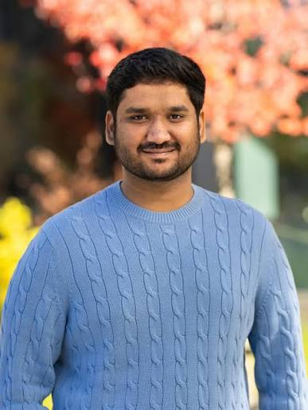
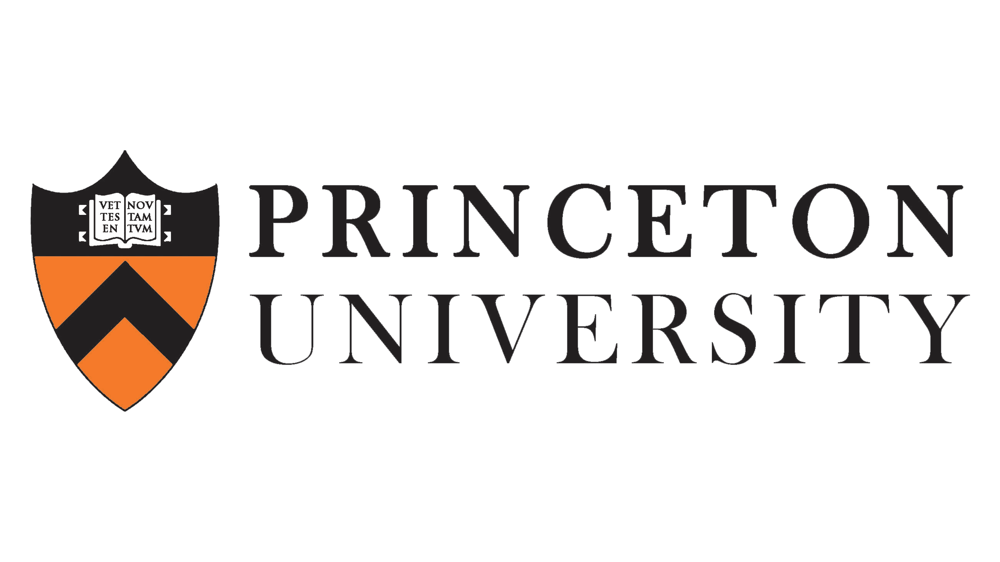

::: {.visual-hero .visual-hero--compact .visual-hero--about-profile}
::: {.visual-hero__content}
::: {.visual-hero__kicker}
About Nakul
:::

# Why I study how animals “talk” to each other

The simplest description of my scientific interest is that I want to understand how animals “talk” to each other: what they communicate, how a signal is directed to a particular partner, what changes when calls are combined, and how individuals learn the vocal patterns of a pair or group.

I use *talk* as a broad, informal term rather than a claim that animal communication is equivalent to human language. A longer-term hope is that an experimentally grounded account of another species' communication system could support a limited form of interspecies communication. Current research remains far from a genuine conversation, but several component questions are increasingly tractable: who produced a signal, who responded, which features vary with social context, and whether manipulating those features changes receiver responses.

::: {.cta-row}
[Download my CV](../cv/Nakul_Wewhare_CV.pdf){.btn .btn-primary}
[Research programme](../research/){.btn .btn-outline-primary}
:::
:::

::: {.visual-hero__media}
```{=html}

```
:::
:::

## Research questions

Animal communication is structured across several levels: calls occur within sequences, responses depend on particular partners, and vocal behaviour can change through social learning. My work therefore addresses both **the information represented in vocal interactions** and **the validity of the methods used to infer that information**.

::: {.feature-grid}
::: {.feature-card}
### Interactional and sequence structure

How are vocal exchanges initiated and maintained? Does acoustic matching predict directed responses? How do order, repetition, and timing alter the information available to a receiver?
:::

::: {.feature-card}
### Social learning and group conventions

Do partners or groups converge in call structure or sequence organization? How do affiliation, dominance, audience, and social-network position affect vocal learning?
:::

::: {.feature-card}
### Individual identity: signal or cue

Which acoustic correlates of caller identity arise incidentally from anatomy, and which are learned or maintained because receivers use them as identity signals?
:::
:::

## Why bats

Bats are a strong comparative system because both perception and vocal production are highly specialized for acoustic behaviour, while their social communication remains less well characterized than echolocation. Common vampire bats are particularly useful because their cooperative behaviour, reciprocity, kinship, and long-term social relationships provide an unusually detailed behavioural framework for interpreting vocal interactions.

My doctoral research investigates vocal matching near the onset of calling bouts, non-random call combinations, population and group variation, and the potential social learning of sequence conventions. These are active analyses and experiments; proposed functions are presented as hypotheses and are separated from descriptive or correlational evidence.

## The path into these questions

Earlier work with budgerigars examined vocal learning within dynamic social networks and sequence organization beyond individual notes. Research with common marmosets then tested whether newly formed pairs converge in vocal-sequence structure across audience conditions. I now extend these questions to vampire bats while continuing comparative work across birds and primates.

## How I think about methods

Every acoustic representation emphasizes some dimensions of signal variation and suppresses others. LFCCs, MFCCs, spectro-temporal measurements, dynamic time warping, and variational autoencoders can therefore produce different similarity structures. I compare representations and validation criteria to determine which biological inferences are robust to these analytical choices.

Separately, I am evaluating whether distributional models adapted from natural-language processing can recover functional relationships among discrete call types from sequence context. Simulation provides a controlled test of representation recovery; empirical validation requires comparison with independently annotated behaviour and receiver responses. This distinction is important: an acoustic space represents similarity in signal structure, whereas a contextual embedding represents similarity in patterns of use.

The [Research](../research/) section links these questions to specific datasets and projects. [Publications](../publications/) lists formal research outputs, and the [Blog](../notes/) contains field reports, analysis updates, methods notes, and literature syntheses.

## Elsewhere

::: {.contact-grid}
::: {.feature-card}
### Curriculum vitae

[View the CV page](../cv/) or [download the PDF](../cv/Nakul_Wewhare_CV.pdf).
:::

::: {.feature-card}
### Google Scholar

[Browse publications and citations](https://scholar.google.com/citations?user=T08iq_UAAAAJ&hl=en).
:::

::: {.feature-card}
### GitHub

[Explore code and repositories](https://github.com/Nakul-wewhare).
:::

::: {.feature-card}
### Carter Lab

[Vampire-bat communication, cooperation, and social cognition](https://socialbat.org/) at Princeton EEB.
:::
:::

::: {.collaboration-cta}
::: {.collaboration-cta__content}
## Something here catch your attention?

Send me a note. I am always happy to talk about animal communication, exchange ideas, help where I can, or hear about a dataset or method you are excited about. The idea can be early and the email can be short.
:::

::: {.collaboration-cta__actions}
[Email me](mailto:nakul@princeton.edu){.btn .btn-primary}
[Visit the blog](../notes/){.btn .btn-outline-primary}
:::
:::

## The institutions that shaped my science

My academic path is an important part of how I see myself as a scientist. I am now a PhD student in Princeton's Department of Ecology & Evolutionary Biology and a member of the Carter Lab. Before Princeton, the BS–MS programme at IISER Pune gave me the freedom to move across biology, mathematics, computation, and animal behaviour; my master's thesis research in the ECEB Lab at JNCASR turned that broad training into sustained work on social relationships and vocal learning.

::: {.institution-grid .institution-grid--about-final}
::: {.institution-card .institution-card--current}
```{=html}
<a class="institution-card__logo" href="https://eeb.princeton.edu/" aria-label="Princeton University Ecology and Evolutionary Biology">
  
</a>
```

::: {.institution-card__body}
[Current]{.institution-card__label}

### [Princeton University](https://eeb.princeton.edu/)

**PhD student · Ecology & Evolutionary Biology.** [Carter Lab](https://socialbat.org/) · advised by [Gerald G. Carter](https://eeb.princeton.edu/people/gerald-g-carter) · 2025–present
:::
:::

::: {.institution-card .institution-card--iiser}
```{=html}
<a class="institution-card__logo" href="https://www.iiserpune.ac.in/" aria-label="IISER Pune">
  
</a>
```

::: {.institution-card__body}
[Scientific training]{.institution-card__label}

### [IISER Pune](https://www.iiserpune.ac.in/)

**BS–MS Dual Degree · Biology.** Interdisciplinary undergraduate and master's training · 2020–2025
:::
:::

::: {.institution-card .institution-card--jncasr}
```{=html}
<a class="institution-card__logo" href="https://www.jncasr.ac.in/" aria-label="Jawaharlal Nehru Centre for Advanced Scientific Research">
  
</a>
```

::: {.institution-card__body}
[Master's thesis research]{.institution-card__label}

### [JNCASR](https://www.jncasr.ac.in/)

**[ECEB Lab](https://sites.google.com/view/eceb-lab) · Evolutionary and Organismal Biology Unit.** Budgerigar social networks and vocal learning · supervised by Anand Krishnan · 2024–2025
:::
:::
:::
