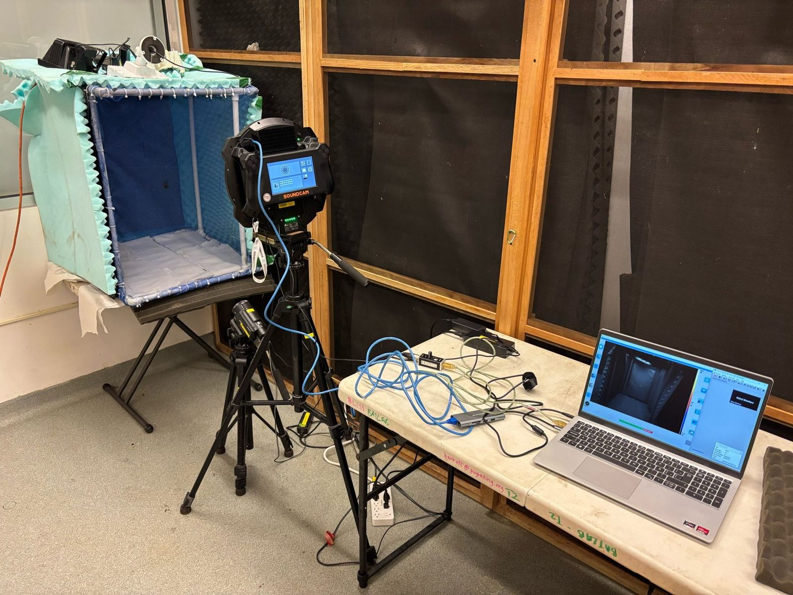
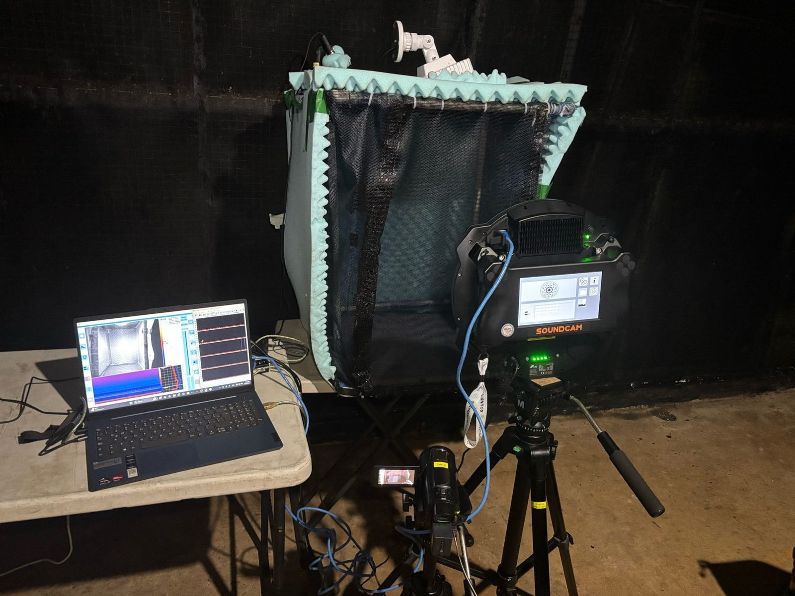
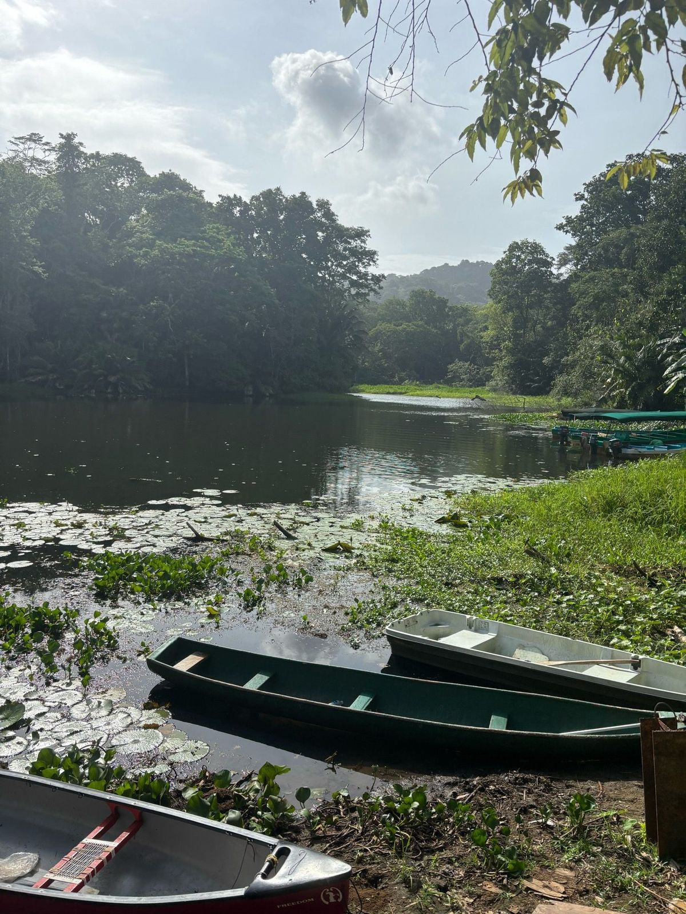
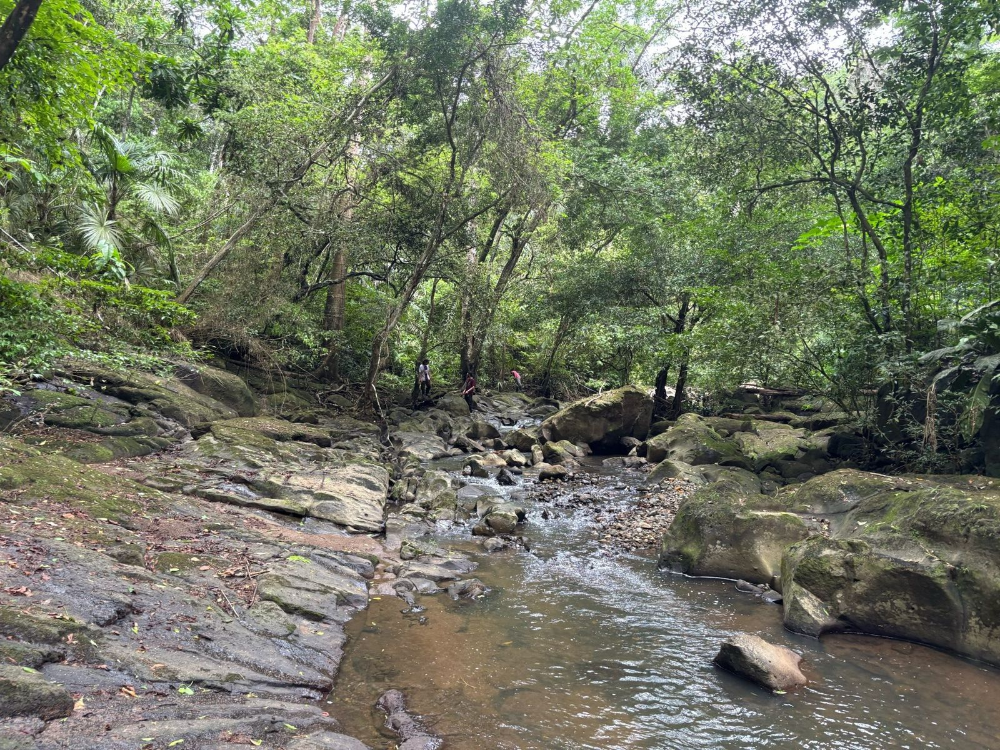
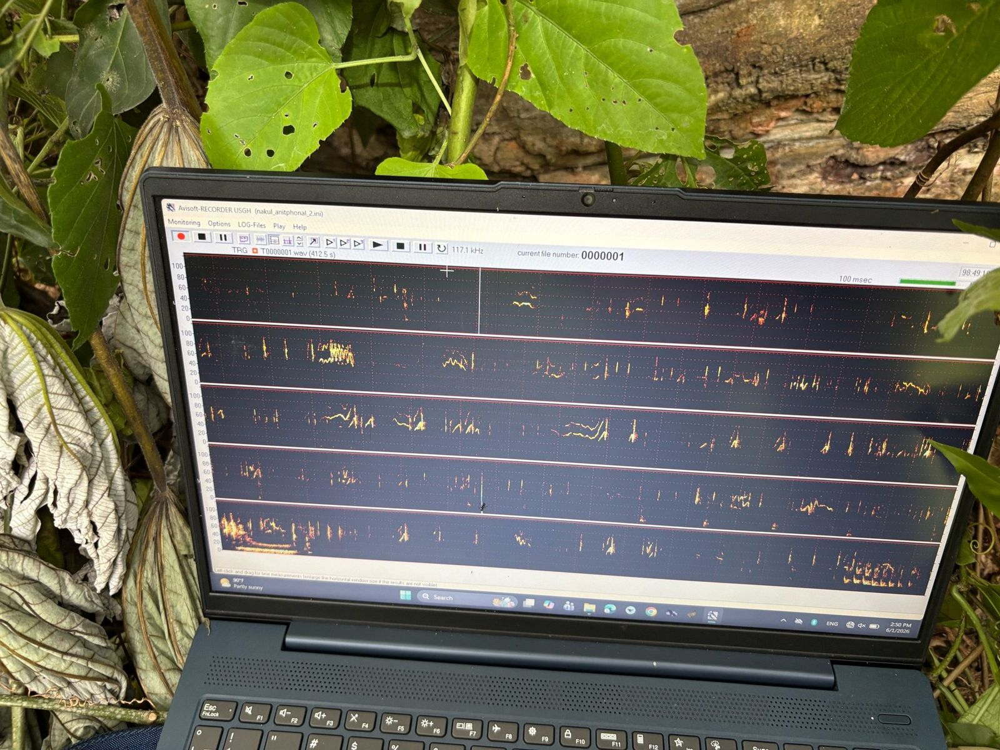

::: {.note-chip .note-chip--field}
Field Note
:::

My 2026 field season did not look like fieldwork every day. Most of my time was spent indoors in the Gamboa lab: recording vampire-bat groups, checking calls, running playback experiments, and building the analyses that connect a vocalization to a caller and a response. The boat trips and forest recording days were mainly for a separate population-dialect project—and were a smaller, but especially fun, part of the season.

## Most days were lab days

Three questions connected much of the lab work. I am testing whether **vocal matching** predicts which bat answers near the beginning of an exchange, how **call combinations** are organized, and what bats are doing before and after particular calls. A sound camera estimates where a call originated; synchronized video can then help associate it with a candidate caller and behaviour. This lets us ask questions such as which bat called, who responded, and whether a bat approached after hearing a particular call.

::: {.media-frame .media-loop .media-loop--wide}
```{=html}
<video controls
       playsinline
       preload="metadata"
       poster="../../../assets/media/bats/vampire-bat-sound-camera-poster.jpg"
       aria-label="Sound-camera recording of interacting vampire bats with synchronized acoustic localization and spectrogram panels."
       aria-describedby="panama-sound-camera-description">
  <source src="../../../assets/media/bats/vampire-bat-sound-camera.mp4" type="video/mp4">
  Your browser does not support embedded video. The caption below describes the recording.
</video>
```

::: {#panama-sound-camera-description .media-frame__caption}
The grayscale panel shows the bats interacting while coloured localization markers estimate where each detected call originated. Synchronized acoustic channels and spectrograms appear at right. Aligning these streams lets us associate calls and call combinations with candidate callers and behaviours such as approach, contact, or withdrawal. The source recording retains its playback controls and audio.
:::
:::

Alongside these recordings, I ran playback experiments to test candidate call functions and measure how bats respond to different calls. The screen recording below shows one analysis tool: a timeline that aligns playback-channel detections with calls from three bats. Zooming moves from an entire night to short response windows, and hovering over a detected call displays its spectrogram.

::: {.media-frame .media-loop .media-loop--wide}
```{=html}
<video controls
       playsinline
       muted
       preload="metadata"
       poster="../../../assets/media/bats/playback-session-timeline-poster.jpg"
       aria-label="Interactive timeline aligning playback detections with calls recorded from three vampire bats."
       aria-describedby="playback-timeline-description">
  <source src="../../../assets/media/bats/playback-session-timeline.mp4" type="video/mp4">
  Your browser does not support embedded video. The caption below describes the visualization.
</video>
```

::: {#playback-timeline-description .media-frame__caption}
An interactive playback-session timeline. Rows represent three recorded bats and the playback channel; selecting and zooming into events reveals their timing and a fixed-window spectrogram. The web version is silent because the source screen recording contained only low-level background audio, not the experimental playback signal. This visualization documents an analysis workflow rather than a result.
:::
:::

::: {layout-ncol=2}
{fig-alt="A sound camera faces a small recording enclosure beside two open laptops and connected cables in the Gamboa laboratory."}

{fig-alt="A sound camera, laptop, and recording enclosure are arranged for a vampire-bat recording session outdoors."}
:::

The vocal-matching, call-combination, sound-camera, and playback analyses are still in progress. The recordings can motivate hypotheses about addressing or call function, but those interpretations require explicit behavioural tests and suitable controls.

## Field days: the dialect project

The field component focused mainly on collecting recordings for a comparative study of vocal variation among geographically separated vampire-bat populations. The goal is to test whether populations differ in call acoustics or sequence organization—not to assume in advance that every difference is a socially learned dialect.

Reaching the recording sites sometimes meant travelling by boat or walking through forest, then checking call spectrograms while we were still in the field. These days were only one part of the season, but they were where most of the adventures happened.

::: {layout-ncol=3}
{fig-alt="Several small boats rest beside a forested waterway at a field site in central Panama."}

{fig-alt="A shallow rocky stream winds through dense tropical forest, with several people crossing among the rocks."}

{fig-alt="A laptop among broad green leaves displays rows of orange and yellow bat-call spectrograms."}
:::

## What comes next

I am now validating caller assignments, analysing vocal matching and call combinations in their behavioural context, comparing recordings across populations, and working through the playback responses. I will post the results as each analysis becomes ready to share.

For the developing scientific details, see [Vampire-Bat Vocal Matching and Exchange Initiation](../../../projects/vampire-bat-vocal-matching.qmd) and [Mapping Bat Calls Back to Behaviour](../../../research/themes/mapping-bat-social-calls/).

*Unless noted otherwise, photographs and video are by Nakul Wewhare; © 2026 Nakul Wewhare.*
