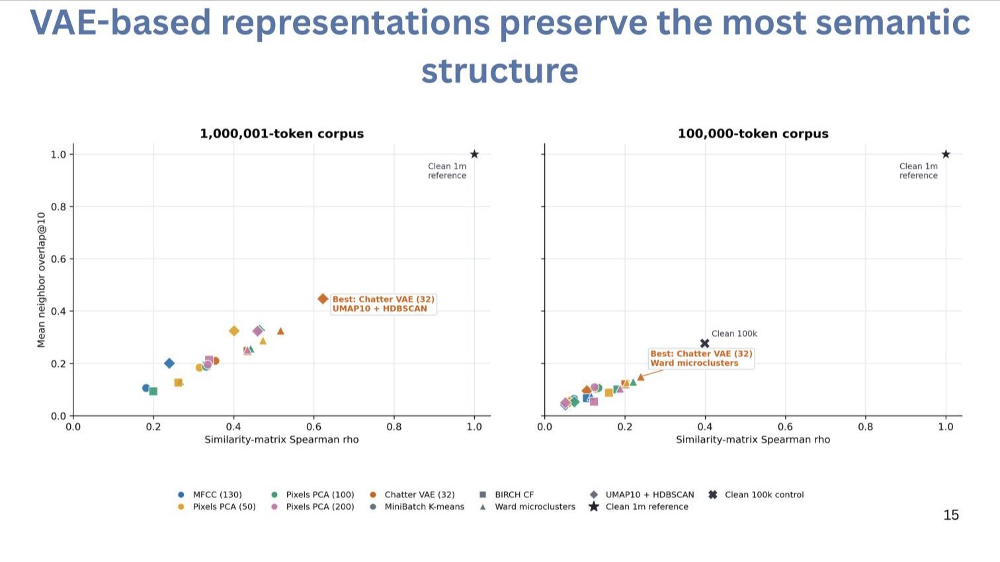
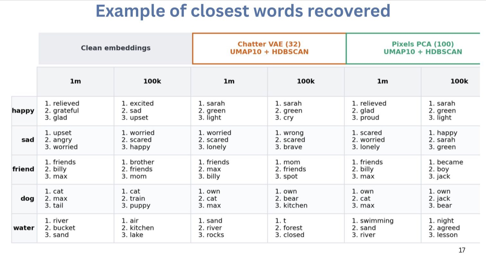

::: {.status-badge .status-badge--developing}
Preliminary methods project
:::

::: {.callout-note}
This page reports an unpublished simulation and an analytical pipeline under development. The results test information recovery under controlled conditions; they are not evidence that animal calls have word-like meanings.
:::

## Research question

Can a contextual-embedding analysis recover known distributional structure after a symbolic sequence has been converted into variable acoustic signals and reconstructed using unsupervised bioacoustic methods?

Word2vec and related distributional models estimate similarity from the sequence contexts in which units occur. They therefore address a different problem from an acoustic space, which measures similarity from properties of the signal itself. The distinction matters: contextual proximity can motivate hypotheses about functional substitution or shared sequence position, but it is not a direct measure of acoustic resemblance or semantic equivalence.

[Read how I construct and validate acoustic spaces](../research/themes/acoustic-spaces/).

## Simulation design

I use text as a controlled system in which the source tokens and their contextual relationships are known. Corpora containing approximately 100,000 and 1,000,000 tokens are converted into synthetic vocalizations. The resulting signals are then processed as if the original token identities were unknown.

The stress test has four stages:

1. Convert known source tokens into acoustically variable synthetic calls.
2. Represent those calls using three alternative acoustic encodings.
3. Recover discrete units with four tokenization pipelines.
4. Train new contextual embeddings on the recovered sequences and compare them with embeddings learned from the original text.

This design isolates information lost through acoustic representation and tokenization before the method is applied to an animal repertoire, where the underlying units and relationships are not known in advance.

## Preliminary aggregate result

Across the tested pipelines, representations based on a variational autoencoder retained the largest proportion of the source embedding structure among the non-control methods. Recovery was stronger in the larger corpus, indicating that sequence-sample size and acoustic classification error jointly constrain performance.

::: {.result-callout}
::: {.result-callout__label}
Current interpretation
:::

**A pipeline can recover broad distributional structure while remaining unreliable at the level of individual nearest neighbours.** Aggregate recovery is therefore necessary but insufficient for interpreting relationships among particular call units.
:::

::: {.plot-panel .plot-panel--invert}
```{=html}

```

::: {.plot-panel__caption}
**Recovery of known contextual structure after acoustic tokenization.** The horizontal axis compares the full pairwise-similarity matrices; the vertical axis measures overlap among each token's ten nearest neighbours. The one-million-token simulation retains more structure than the 100,000-token simulation. Clean-text references indicate a performance ceiling and are not directly comparable acoustic pipelines.
:::
:::

## Local relationships remain uncertain

::: {.plot-panel .plot-panel--invert}
```{=html}

```

::: {.plot-panel__caption}
Example neighbourhoods reveal errors that an aggregate score can obscure. Some distributional relationships persist, particularly in the larger corpus, but individual recovered neighbours can be unrelated to the source neighbourhood. In animal data, a contextual neighbour should therefore be treated as a candidate relationship for independent testing rather than as a translation.
:::
:::

## Interpretation and limitations

- The simulation evaluates recovery of a known distributional structure; it does not establish that the same structure exists in vampire-bat communication.
- Results depend on the simulated acoustic variation, corpus size, representation, tokenization procedure, and contextual-model specification.
- Word2vec encodes statistical substitutability within a sequence window. It does not identify referential meaning or communicative function without external evidence.
- Discretization errors can merge functionally distinct signals or split variable instances of one signal, altering the sequences supplied to the contextual model.
- Behavioural observations, social context, and controlled playback are required to evaluate candidate relationships in an animal system.

## Next analyses

The next stage is to apply the pipeline to vampire-bat vocal sequences while retaining explicit uncertainty from acoustic tokenization. Candidate contextual relationships will be compared with sound-camera behaviour annotations, caller and receiver identity, social relationships, and playback responses. I also plan to compare discrete-token models with sequence models that retain continuous acoustic information.

## Related work

- [Constructing and validating acoustic spaces](../research/themes/acoustic-spaces/)
- [Call combinations and sequence learning](../research/themes/call-combinations/)
- [Mapping vampire-bat calls to behaviour](../research/themes/mapping-bat-social-calls/)
- [Vampire-bat conversations in acoustic space](vampire-bat-vocal-matching.qmd)
- [Methods and learning resources](../methods/)

::: {.collaboration-cta}
::: {.collaboration-cta__content}
## Curious about sequence embeddings?

I would love to compare sequence-embedding methods, think through uncertainty from acoustic classification, or test contextual relationships against independently annotated behaviour or experiments. Send me a note even if the idea is still exploratory.
:::

::: {.collaboration-cta__actions}
[Email me](mailto:nakul@princeton.edu){.btn .btn-primary}
[View the acoustic-space theme](../research/themes/acoustic-spaces/){.btn .btn-outline-primary}
:::
:::
