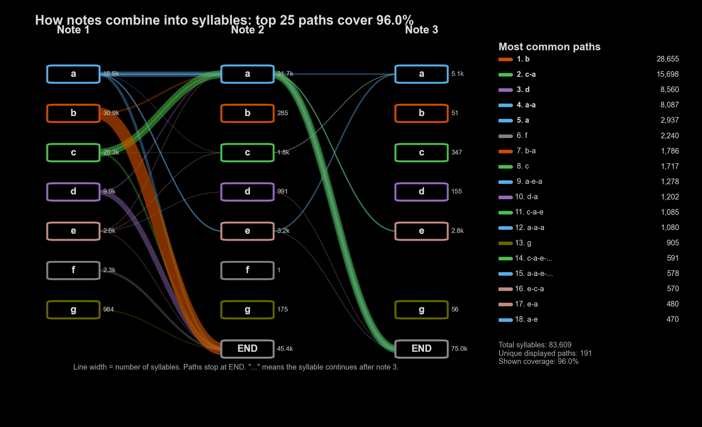

::: {.theme-page-hero}
::: {.theme-page-hero__number}
02
:::

::: {.theme-page-hero__copy}
::: {.eyebrow}
Call combinations & sequence learning
:::

# Sequence structure as a learned component of communication

Analyses based on isolated call types omit information carried by **order, repetition, timing, and social context**. I study how these sequence-level properties vary across individuals and groups, whether they change following social association, and which experimental comparisons are required to establish receiver-relevant function.

::: {.status-badge .status-badge--active}
Active comparative theme
:::

[Last updated 28 August 2026]{.theme-page-hero__updated}
:::
:::

::: {.callout-note}
This page synthesizes peer-reviewed results, public preprints, and preliminary analyses. The evidential status of each result is stated explicitly; preliminary estimates and interpretations may change following validation and review.
:::

## Levels of inference

::: {.process-row}
::: {.process-step}
`01`

### Statistical structure

Quantify transition probabilities, repetition, and higher-order dependencies relative to specified null or generative models.
:::

::: {.process-step}
`02`

### Social accommodation

Test whether sequence similarity changes with pair formation, group contact, or other changes in social association.
:::

::: {.process-step}
`03`

### Functional validation

Compare receiver responses to intact sequences, constituent calls, reordered sequences, and contextually matched controls.
:::
:::

## Audience-dependent sequence convergence in common marmosets

In a public marmoset preprint currently in revision, six adults were recorded before the formation of three male–female pairs and again four months later. Following pair formation, partners showed increased sequence similarity when calling to non-partners. This pattern was supported by the combined model and three of four sequence measures; repeat-length distributions did not show a clear change. No comparable convergence was detected in partner-directed sequences. Individual phee-call acoustics showed no clear convergence in either audience context across spectro-temporal, MFCC, constrained dynamic-time-warping, and variational-autoencoder representations.

The audience-specific result is consistent with sequence organization functioning as a pair-level signature expressed toward non-partners. The production data support adult flexibility at the sequence level, but they do not establish receiver perception, shared meaning, or a learned convention.

[Study design, results, and limitations](../../../projects/marmoset-vocal-convergence.qmd).

## Vocal structure within a competitive social network

An unpublished budgerigar study followed one mixed-sex colony for four weeks. Among six acoustically sampled males, dyads with higher rates of aggression had more similar warble syntax and shared more candidate call subtypes. Dyads with higher rates of mutual display produced more acoustically distinct variants within shared subtypes and a lower proportion of calls assigned to those shared categories. Higher-ranking males occupied more connected positions in the call-subtype-sharing network.

These estimates describe observational associations within one colony and do not establish causal direction. They motivate experimental manipulation of social exposure, dominance relations, or acoustic similarity to distinguish interaction-driven accommodation from shared experience and other alternatives.

[Study design, preliminary results, and limitations](../../../projects/budgerigar-competition-vocal-structure.qmd).

## Sequence structure in vampire-bat social calls

Preliminary analyses indicate non-random transitions among provisional vampire-bat call types and possible population differences in sequence structure. Current work links combinations to synchronized behavioural observations. A subsequent group-contact design could test whether population-associated structures change following social exposure and distinguish short-term accommodation from longer-term convergence.

::: {.callout-note}
The population and combination analyses are preliminary. Claims about convention or communicative meaning require formal comparison with null models, independent replication, behavioural association, and receiver-response experiments.
:::

## From continuous variation to provisional sequence units

::: {.media-frame .media-loop .media-loop--wide}
```{=html}
<video controls
       playsinline
       muted
       preload="metadata"
       poster="../../../assets/media/bats/vampire-bat-acoustic-space-exploration-poster.png"
       aria-label="Silent screen recording navigating a vampire-bat LFCC–UMAP acoustic space and provisional call categories."
       aria-describedby="theme2-acoustic-space-description">
  <source src="../../../assets/media/bats/vampire-bat-acoustic-space-exploration.mp4" type="video/mp4">
  Your browser does not support embedded video. The caption below describes the visualization.
</video>
```

::: {#theme2-acoustic-space-description .media-frame__caption}
This cropped, silent screen recording displays an LFCC–UMAP projection, individual spectrograms, and a provisional seven-type classification. Calls from different individuals overlap across much of the projection, indicating that its broad structure is not reducible to individual identity. The categories provide operational units for sequence analysis; they are not a validated repertoire taxonomy.
:::
:::

## Transition structure among provisional call types

::: {.plot-panel}
```{=html}

```

::: {.plot-panel__caption}
Within a provisional seven-type classification, `b` frequently terminates a sequence, `c` frequently precedes `a`, and `a` frequently repeats or transitions to `e`. These descriptive patterns motivate formal tests against sequence null models and analyses of whether particular transitions predict behavioural context or group membership.
:::
:::

## Project evidence across species

- [Sequence-level vocal convergence in common marmosets](../../../projects/marmoset-vocal-convergence.qmd)
- [Dialectic variation and sequence convergence in budgerigars](../../../projects/budgerigar-dialectic-convergence.qmd)
- [Competition, rank, and learned vocal structure in budgerigars](../../../projects/budgerigar-competition-vocal-structure.qmd)
- [Parrot vocal sequences across species](../../../projects/parrot-vocal-sequences.qmd)
- [Social networks and vocal learning in budgerigars](../../../projects/social-networks-and-vocal-learning.qmd)

::: {.collaboration-cta}
::: {.collaboration-cta__content}
## Have sequences I should know about?

I am especially interested in datasets that link complete vocal sequences to audience composition, behaviour, social relationships, or population history. I would also be happy to talk through experiments using intact combinations and reordered or acoustically matched controls.
:::

::: {.collaboration-cta__actions}
[Email me](mailto:nakul@princeton.edu){.btn .btn-primary}
[All six themes](../../){.btn .btn-outline-primary}
:::
:::
