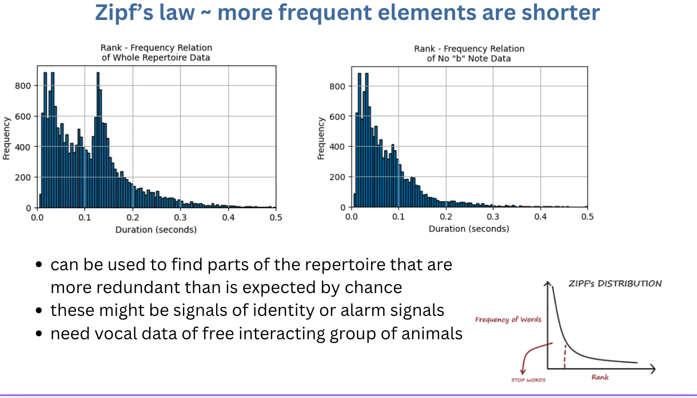

::: {.theme-page-hero}
::: {.theme-page-hero__number}
04
:::

::: {.theme-page-hero__copy}
::: {.eyebrow}
Linguistic laws & structured deviations
:::

# Testing scaling relationships and their biological alternatives

Human language exhibits recurrent statistical relationships among element frequency, duration, rank, and sequence position. Testing analogous relationships in animal repertoires requires explicit definitions of units, sampling processes, and null expectations. I am particularly interested in whether systematic **departures** from a fitted relationship identify call classes shaped by different production constraints or information requirements.

::: {.status-badge .status-badge--developing}
Exploratory research direction
:::

[Last updated 28 August 2026]{.theme-page-hero__updated}
:::
:::

::: {.callout-note}
This page contains an exploratory visualization and proposed analyses. The displayed distribution is not a fitted test of a linguistic law, and no communicative function is inferred from it.
:::

## Exploratory budgerigar duration distributions

::: {.plot-panel .plot-panel--invert}
```{=html}

```

::: {.plot-panel__caption}
**Exploratory duration distributions.** The left panel includes the complete working repertoire; the right excludes note type `b`. The site applies a display-only colour inversion to the original figure for legibility against the dark background.
:::
:::

**Zipf's law of abbreviation** predicts a negative relationship between element frequency and duration. In this exploratory budgerigar repertoire, the complete duration distribution contains a second concentration of relatively long elements. Excluding note type `b` produces a more nearly monotonic decline. This descriptive contrast identifies `b` as a candidate contributor to heterogeneity in the frequency–duration relationship and motivates tests of whether contact-call structure, individual identity, or sampling composition accounts for the pattern.

The histograms do **not** estimate a Zipfian relationship, demonstrate redundancy beyond chance, or identify a signal function. Required next steps include fitting frequency–duration models, comparing biologically appropriate null models, accounting for repeated observations within individuals and call classes, and analysing recordings of freely interacting groups.

## Competing explanations for structured deviations

::: {.question-grid}
::: {.question-card}
### Identity

Socially learned contact calls may deviate from repertoire-wide scaling if reliable individual or group discrimination favours additional acoustic structure.
:::

::: {.question-card}
### Alarm and urgency

Signals produced in urgent or noisy contexts may favour detectability and transmission robustness over reduced duration.
:::

::: {.question-card}
### Motor constraints

Respiratory, biomechanical, or body-size constraints may generate duration differences without selection for information transmission.
:::

::: {.question-card}
### Sampling and categories

Mixtures of call types, unequal observation effort, non-independent sampling, and analyst-defined segmentation can generate apparent scaling relationships or deviations.
:::
:::

## Planned inferential framework

1. Define the candidate communicative unit and alternative biological explanations before model fitting.
2. Compare observed relationships with null models that preserve relevant base rates, individual sampling, and sequence constraints.
3. Estimate within- and between-individual effects across groups, contexts, and populations.
4. Test whether model residuals or class-specific deviations predict caller identity, audience, behaviour, or receiver response.
5. Use linguistic laws as quantitative hypotheses about signal organization, not as categorical evidence of language-like complexity.

## Related work

- [Dialectic variation and sequence convergence in budgerigars](../../../projects/budgerigar-dialectic-convergence.qmd)
- [Parrot vocal sequences across species](../../../projects/parrot-vocal-sequences.qmd)
- [Identity: cue or signal?](../identity-cue-or-signal/)

::: {.collaboration-cta}
::: {.collaboration-cta__content}
## Have a comparative dataset or idea?

I would love to hear about datasets that retain individual identity, social context, complete sequences, and sampling effort. I am also happy to compare ideas about hierarchical models, sequence-preserving null models, or cross-species tests with standardized unit definitions.
:::

::: {.collaboration-cta__actions}
[Email me](mailto:nakul@princeton.edu){.btn .btn-primary}
[All six themes](../../){.btn .btn-outline-primary}
:::
:::
