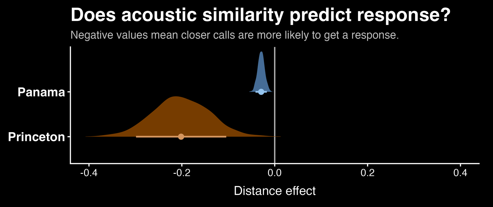

::: {.theme-page-hero}
::: {.theme-page-hero__number}
01
:::

::: {.theme-page-hero__copy}
::: {.eyebrow}
Vocal matching & directed exchanges
:::

# Vocal matching as a candidate mechanism of exchange initiation

In multi-individual groups, the onset of a vocal exchange presents a recipient-selection problem: the intended receiver must distinguish a directed signal from calls addressed to other group members. My current work tests whether short-term acoustic matching predicts response probability in common vampire bats (*Desmodus rotundus*), and whether the association is concentrated near the onset of calling bouts.

::: {.status-badge .status-badge--active}
Active PhD analysis
:::

[Last updated 28 August 2026]{.theme-page-hero__updated}
:::
:::

::: {.callout-note}
This page reports preliminary analyses and explicitly identified working hypotheses. Estimates, classifications, and interpretations may change following model validation, playback experiments, and manuscript review.
:::

## Analytical rationale

An initial analysis tested for individually distinctive vocal labels that could be used to address a specific partner. That analysis did not provide evidence for such labels in one vampire-bat dataset. An alternative association was detected: response probability increased when an incoming call was acoustically similar to the potential responder's recent calls.

This association is consistent with **vocal matching**, but acoustic similarity alone does not establish a communicative function. Preliminary analyses indicate heterogeneity among provisional call types and across positions within a bout. The working hypothesis is that matching contributes to exchange initiation or recipient selection, after which the interacting bats transition to other repertoire regions.

::: {.callout-note}
The observational association and its temporal distribution motivate this hypothesis. Controlled playback experiments are required before assigning an addressing, acknowledgement, or engagement function.
:::

## Preliminary analysis across two datasets

A response was operationally defined as a call produced by another bat within five seconds. For each potential responder, acoustic distance was calculated as the minimum distance between the incoming call and that individual's preceding three calls.

The analysis currently includes two independently collected datasets:

- **Princeton pairs:** 8 female bats, 28 pairs, 84 recording hours, and 3,864 calls.
- **Panama trios:** 11 female and 6 male bats, 26 trios, 312 recording hours, and 140,913 calls.

::: {.plot-panel}
```{=html}

```

::: {.plot-panel__caption}
In both the Princeton pair recordings and Panama trio recordings, response probability within five seconds decreased as acoustic distance from the potential responder's recent calls increased. The estimated association is larger in the Princeton dataset. Model specifications and validation remain in development.
:::
:::

Preliminary call-type models suggest that the association is concentrated in a subset of the provisional types—particularly `a`, `a-a`, `a-e-a`, and `b`—several of which occur disproportionately early in bouts. This distribution is compatible with an initiation hypothesis, but neither the classification nor the proposed function has been experimentally validated.

## Acoustic-trajectory visualization

::: {.media-frame .media-loop .media-loop--wide}
```{=html}
<video controls
       playsinline
       preload="metadata"
       poster="../../../assets/media/bats/vampire-bat-vocal-matching-poster.jpg"
       aria-label="Animated LFCC–UMAP trajectories of calls exchanged by three vampire bats."
       aria-describedby="matching-theme-video-description">
  <source src="../../../assets/media/bats/vampire-bat-vocal-matching.mp4" type="video/mp4">
  Your browser does not support embedded video. The caption below describes the visualization.
</video>
```

::: {#matching-theme-video-description .media-frame__caption}
Each coloured trajectory represents one bat's successive calls in a two-dimensional UMAP projection of LFCC features; the spectrograms at right show the corresponding calls. Under a matching prediction, a new call should approach another bat's recent position in the selected representation. This visualization is exploratory: UMAP does not preserve all high-dimensional distances, and projected proximity is neither a statistical test nor evidence of communicative meaning.
:::
:::

## Current hypotheses and tests

::: {.question-grid}
::: {.question-card}
### Timing

Estimate whether the acoustic-distance effect is strongest near bout onset rather than constant throughout an exchange.
:::

::: {.question-card}
### Call type

Test whether the association is restricted to particular provisional call types or distributed across the repertoire.
:::

::: {.question-card}
### Response

Compare response probability to candidate initiating calls and acoustically or contextually matched control stimuli.
:::

::: {.question-card}
### Partner specificity

Evaluate whether acoustic matching predicts responder identity when multiple known group members are available.
:::
:::

## Temporal position as an explanatory variable

Calls produced at bout onset may have different functions from calls produced after an interaction is established, including attention recruitment, recipient selection, or coordination of participation. Pooling calls across entire recording periods can obscure an effect restricted to a short temporal interval. The analyses therefore model position within the exchange rather than treating all calls as exchangeable observations.

## Project evidence

- [Vampire-bat vocal matching and exchange initiation](../../../projects/vampire-bat-vocal-matching.qmd) — study design, preliminary analyses, visualizations, and planned tests.
- [Mapping bat calls back to behaviour](../mapping-bat-social-calls/) — how sound-camera recordings connect the acoustic event to a caller and behaviour.
- [Identity: cue or signal?](../identity-cue-or-signal/) — the broader distinction between a call revealing identity and intentionally addressing an individual.

::: {.collaboration-cta}
::: {.collaboration-cta__content}
## Want to compare notes on vocal matching?

I would love to hear from people comparing response-timing models, developing playback controls, or analysing recordings in which several identified group members can respond to the same initiating call. A short email about the system or question is plenty.
:::

::: {.collaboration-cta__actions}
[Email me](mailto:nakul@princeton.edu){.btn .btn-primary}
[All six themes](../../){.btn .btn-outline-primary}
:::
:::
